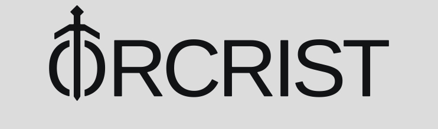

# Orcrist Technologies SRE interview challenge



This is a challenge to test your skills as a Site Reliability Engineer (SRE).

# The challenge

You have to fork this repository to complete the following challenges in your own `github` account. If you have any doubt, don't hesitate to contact us .

There are **5 basic challenges** and **3 extras challenges**.
We recommend to finish as many of the basic exercises as possible and the extra ones only if you want demonstrate more.

- Every challenge must have a **README.md** in the respective directory.
- The content of **README.md** must contain the **how-to obtain the result**, **executed commands** and **a short explanation** (if necessary).

## Challenge 1: Basic search

> _NOTE: Go `challenge-1` directory._

We've found a `sample.log` file with 3360 lines but we need some info. Can you help us?

- Count all lines with `500` HTTP code.
- Count all `GET` requests from `yoko` to `/rrhh` location and if it was successful (`200`).
- How many requests go to `/`?
- Count all lines _without_ `5XX` HTTP code.
- Replace all `503` HTTP codes by `500`, how many requests have a `500` HTTP code?

## Challenge 2: System information scripting

> _NOTE: Create `challenge-2` directory._

Create a simple Python script that can be used to get system information. The script should have the following CLI interface:

```sh
Usage: myscript.py [options..]
Myscript description

Myscript options:
  -d, --disk       check disk stats
  -c, --cpu        check cpu stats
  -p, --ports      check listen ports
  -r, --ram        check ram stats
  -o, --overview   top 10 process with most CPU usage.
```

- disk stats: volumes, total, used, free, used percentage
- cpu stats: cores, usage, frequency
- ram stats: total, used, free, used percentage
- ports stats: listening ports
- top 10 process with most CPU usage

## Challenge 3: Is it running?

> _NOTE: Go `challenge-3` directory._

Containerize the HTTP server implemented in `server.py` with `docker`. Please create the necessary `Dockerfile`.
What result does making a `GET` request to the server with the header `Challenge: orcrist.org` return?

## Challenge 4: What's wrong?

> _NOTE: Go to `challenge-4` directory._

Oh, no! We don't know what happened to this binary! Can you help us?
When we execute the binary, it always returns `Ooooh, what's wrong? :(`.
How can we fix it? We expected the message `Congrats! :)`.

> _TIP: The binary was compiled for x86_64 Linux._

## Challenge 5: Helm Chart

> _NOTE: Go to `challenge-5` directory._

Create a Helm chart to deploy the Python HTTP server from `challenge-3` to Kubernetes.

You will find a minimal chart scaffold in `server-chart/`. Complete it with:

- Define configurable values in `values.yaml` (image, replicas, service, etc.)
- Create a Kubernetes Deployment in `templates/deployment.yaml`
- Create a Kubernetes Service in `templates/service.yaml`
- Ensure all hardcoded values are parameterized

Your chart should:

- Pass `helm lint ./server-chart`
- Render valid manifests with `helm template ./server-chart`
- Be installable with `helm install server ./server-chart`

See the `challenge-5/README.md` for detailed requirements and acceptance criteria.

# Extra Challenges

Optional extra challenges, not required to pass.

## Extra Challenge 1: Kubernetes

> _NOTE: Go `challenge-extra-1` directory._

Prepare environment:

- Install [microk8s](https://microk8s.io/) or [minikube](https://minikube.sigs.k8s.io/docs/start/).
- Execute `kubectl apply -f manifests/`.

Get info.:

- Get all namespaces.
- Get all pods from all namespaces.
- Get all resources from all namespaces.
- Get all services from namespace `orcrist`.
- Get all deployments from `tools`.
- Get image from `nginx` deployment on `orcrist` namespace.
- Create a `port-forward` to access `nginx` pod on `orcrist` namespace.

## Extra Challenge 2: Terraform

> _NOTE: Create `challenge-extra-2` directory._

- Use [Terraform](https://www.terraform.io/) to provision the Kubernetes cluster with the same resources as in `challenge-extra-1`.
- Upload all files when you've finished the task.

## Extra Challenge 3: Test Helm Chart

> _NOTE: Create `challenge-extra-3` directory._

- Use [helm-unittest](https://github.com/helm-unittest/helm-unittest) or [chart-testing](https://github.com/helm/chart-testing) to write tests for your `challenge-5` Helm chart.
- Write tests that verify the Deployment and Service are rendered correctly with expected values.
- Upload all files when you've finished the task.
